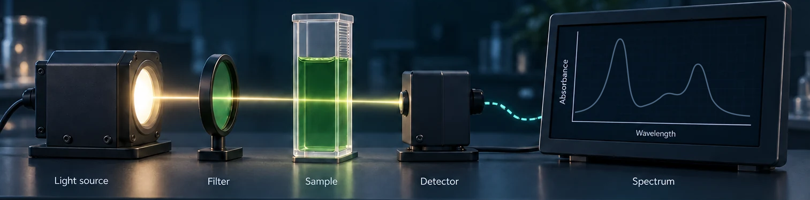

# PASA · Photosynthetic Absorbance Spectra Analyzer

**[Open PASA — use it online](https://armanpazuki.shinyapps.io/pasa/)** · No installation needed.



**Version 1.0.0** — an interactive R/Shiny workspace for exploring absorbance spectra, comparing samples, and recording reproducible analysis settings.

Load your spectra, choose the analysis settings, and explore spectral curves, band measurements, data quality, illustrative sample colors, and cell growth. Advanced mode adds constrained spectral deconvolution. Short and detailed guided tours introduce the controls and explain how to interpret the outputs.

## Run PASA locally

Install **R 4.6.0**, then download this repository or clone it:

```sh
git clone https://github.com/arman-pazuki/PASA.git
cd PASA
Rscript --vanilla reproducibility/INSTALL_DEPENDENCIES.R
Rscript --vanilla reproducibility/VERIFY_ENVIRONMENT.R
Rscript --vanilla START_PASA.R
```

On Windows, after installing the dependencies, you can also double-click **START_PASA.cmd**. On Linux and macOS, install the native libraries listed in [R and package requirements](reproducibility/R_PACKAGE_REQUIREMENTS.md) before restoring the packages.

The repository contains the application, interface artwork, color reference tables, synthetic example, launchers, and exact dependency lock. It does not need a previous PASA version. R and its packages are installed separately; the first installation requires internet access. Local-file analysis works offline afterward. Remote data import and online feedback need a connection.

## Try an example

Choose **Open PASA → Input data → Demo data → Load demo data**, or upload [the synthetic workbook](examples/EXAMPLE_SYNTHETIC_SPECTRA.xlsx). The first column contains wavelength in nm; each remaining column contains one sample. CSV, TSV, text, and Excel files are supported.

Analysis settings have their own tab. Visit **Summary** to review the settings, then inspect **Spectra**, **Metrics**, **Band AUC**, **Data Quality**, **Sample Color**, or **Cell Growth**. Save a session to preserve data and settings together, or export the resulting tables and plots.

## Documentation and reproducibility

- [Interface guide](docs/INTERFACE_GUIDE.md) and [analysis options](docs/ANALYSIS_OPTIONS_GUIDE.md)
- [Installation and launch](reproducibility/INSTALLATION.md)
- [R and package requirements](reproducibility/R_PACKAGE_REQUIREMENTS.md)
- [Release verification](RELEASE_VERIFICATION.md)
- [Method and interpretation limits](docs/RECOVERY_EVIDENCE_SCOPE.md)
- [Privacy and network behavior](privacy_network/README.md)
- [Deploying to Shiny](reproducibility/HOSTED_DEPLOYMENT.md)

Quality tiers, deconvolution model rankings, and illustrative colors depend on their stated assumptions. They support interpretation; they do not independently establish pigment identity, instrument calibration, or biological validity. The app explains these limits alongside its results.

## Cite and contact

Please cite **PASA version 1.0.0** when reporting analyses; [CITATION.cff](CITATION.cff) contains the software citation. Contact the authors through the app's **Feedback** tab or [pasa.app@outlook.com](mailto:pasa.app@outlook.com).

Author-created software is licensed under MIT. Documentation and original artwork use CC BY 4.0; the adapted CIE tables retain CC BY-SA 4.0. See [component licenses](LICENSE.md) and [third-party notices](THIRD_PARTY_NOTICES.md).
